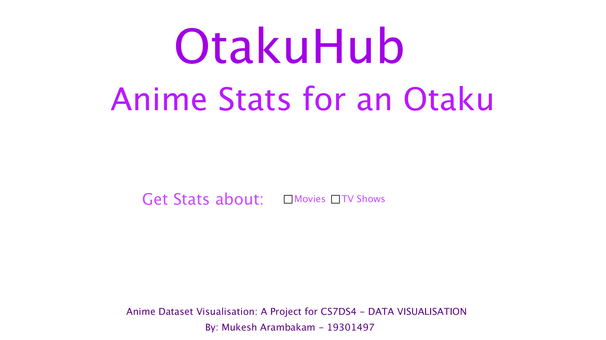

# Visualization of Popular Graphs
Data Visualization of popular graphs using py.processing

1. [Jhon Snow's - Cholera Outbreak](https://scienceline.org/2010/05/john-snows-maps-of-the-broad-street-cholera-outbreak/)
2. [Nightingale's Rose](https://understandinguncertainty.org/node/214)
3. [Minard's Map](https://www.nationalgeographic.com/news/2017/03/charles-minard-cartography-infographics-history/)

Exploratory Data Visualization Project

4. [Otaku Hub](https://github.com/mukeshmk/data-visualization/tree/master/otaku_hub)

#### OUTPUTS:

1. Jhon Snow's - Cholera Outbreak

2. Nightingale's Rose

3. Minard's Map

4. Otaku Hub

#### REFERENCES:
Tutorial for processing.py: https://py.processing.org/reference/

Tutorial for processing in Java: https://processing.org/reference/
